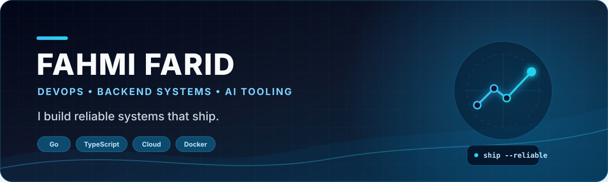

 

  
  
  

## Hey, I’m Fahmi 👋

I build **reliable backend systems**, **delivery automation**, and **AI-assisted developer tools**. My work sits where product engineering meets infrastructure: clear APIs, repeatable deployments, and practical software that ships.

- ⚙️ Building API-first platforms, CI/CD workflows, and containerized environments
- 🧱 Working with clean architecture, authentication, payments, and workflow-heavy products
- 🤖 Exploring coding agents, context engineering, and developer automation
- 🚀 Turning experiments into documented, reusable open-source projects
- 💬 Open to collaboration through [GitHub Discussions](https://github.com/fhmifarid/fhmifarid/issues/new?title=Collaboration%20idea)

## Featured open-source work

<table>
  <tr>
    <td width="50%" valign="top">
      <h3><a href="https://github.com/fhmifarid/iconify-downloader">Iconify Downloader</a></h3>
      
Desktop app and CLI for finding, customizing, organizing, and exporting Iconify icons as SVG, JSON, or ZIP bundles.

      
<code>TypeScript</code> <code>React</code> <code>Electron</code> <code>Vite</code>

      <a href="https://github.com/fhmifarid/iconify-downloader">Explore the project →</a>
    </td>
    <td width="50%" valign="top">
      <h3><a href="https://github.com/fhmifarid/sawa">SAWAA Backend</a></h3>
      
Go API for visa and travel services with order workflows, wallet accounting, payment approvals, support chat, and audit logging.

      
<code>Go</code> <code>PostgreSQL</code> <code>Docker</code> <code>Clean Architecture</code>

      <a href="https://github.com/fhmifarid/sawa">Explore the project →</a>
    </td>
  </tr>
  <tr>
    <td colspan="2" valign="top">
      <h3><a href="https://github.com/fhmifarid/agentapi">AgentAPI Lab</a></h3>
      
Research and adaptation around a unified HTTP control layer for coding agents such as Codex, Claude Code, Gemini, and Aider.

      
<code>Go</code> <code>HTTP API</code> <code>AI Agents</code> <code>Developer Tooling</code>

      <a href="https://github.com/fhmifarid/agentapi">Explore the research fork →</a>
    </td>
  </tr>
</table>

## Technologies I use

  

## GitHub activity

  
   
  
  
   
  Live activity generated from the public GitHub profile.

## Let’s build something useful

I’m open to thoughtful collaboration on **developer tools**, **AI infrastructure**, and **backend/platform systems**.

  
  

  If my work helps you, follow along or star a project — it helps others discover it too.

